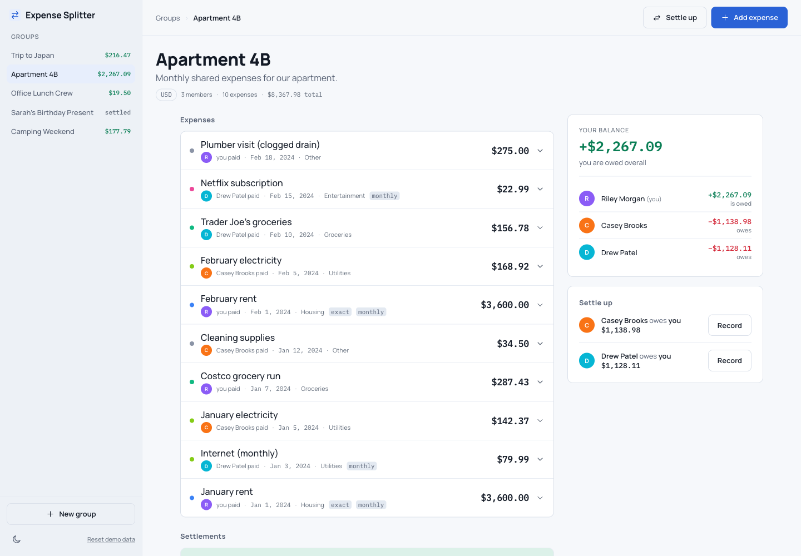

# Expense Splitter

Split shared costs with friends, roommates, and travel companions: log an expense, choose how it divides, and the app keeps track of who owes whom until everyone is square.

This is a solution to the [Expense Splitter product challenge](https://www.frontendmentor.io/challenges/expense-splitter) on Frontend Mentor. The original brief is kept in [BRIEF.md](./BRIEF.md).

## Table of contents

- [Overview](#overview)
  - [Screenshot](#screenshot)
  - [Links](#links)
- [Running the project](#running-the-project)
- [Built with](#built-with)
- [Exchange rates](#exchange-rates)
- [Features](#features)
- [Implementation notes](#implementation-notes)
- [What I learned](#what-i-learned)
- [Continued development](#continued-development)
- [Author](#author)

## Overview

Five sample groups load on first run — a trip, a flat share, an office lunch crew, a group gift, and a camping weekend — chosen so the app is exercised by real edge cases: a multi-currency trip, a group where only two members still owe each other, and expenses split four different ways.

This is the **frontend-only path** described in `spec/technical-requirements.md`: no accounts, no server, `localStorage` in place of a database. Everything else in the brief still applies.

### Screenshot



### Links

- Challenge: https://www.frontendmentor.io/challenges/expense-splitter
- Live Site URL: https://citron07r.github.io/FrontendMentor/expense-splitter/
- Repository: https://github.com/citron07r/FrontendMentor/tree/main/expense-splitter

## Running the project

No build step and no dependencies. The app fetches its seed data, so it needs to be served over HTTP rather than opened from the filesystem:

```bash
python3 -m http.server 8000
```

Then visit http://localhost:8000/expense-splitter/.

## Built with

- Semantic HTML with `header`, `aside`, `main`, and native `<dialog>` overlays
- CSS custom properties, split into `tokens.css` (the design system) and `style.css` (components)
- Vanilla JavaScript ES modules, no framework and no bundler
- Node's built-in test runner for the money core
- Hash-based routing for the landing page, group list, and per-group views
- `localStorage` for persistence, seeded from `data/sample-groups.json`

`starter/` holds the unmodified starter assets shipped with the challenge. They are kept for reference and are **not** loaded by the app — the live styles are `tokens.css` and `style.css` at the project root.

## Features

- **Four split types** — equal, exact amounts, percentages, and shares
- **Multi-currency expenses** with live rates from [Frankfurter](https://frankfurter.dev) (ECB data, no API key). Rates are fetched once on load and cached for twelve hours; the rate in force is stored on each expense, so historical balances never move when rates do
- **Balances and settle-up** — greedy pairwise netting reduces the debts to the fewest payments that clear the group
- **Recording settlements**, capped at the outstanding debt for that pair
- **Filtering and a spending breakdown** by category, member, and date range
- **Light and dark themes**, remembered across visits
- **Keyboard support throughout** — skip link, focus-managed dialogs, an inert off-canvas sidebar, and errors tied to the fields that caused them

## Tests

The money core lives in `js/money.js`, free of DOM and storage so it can be
exercised directly:

```bash
node --test expense-splitter/tests/money.test.js
```

Twenty-six tests cover rounding, remainder distribution, balance derivation,
currency conversion, split validation, and settle-up — the places where a bug is silent, because
the interface still renders and only the numbers are wrong.

## Exchange rates

Frankfurter was chosen because it needs no API key. On a static site there is no
server to keep a secret behind, so a key-required provider would either not work
or ship the key in readable source. (`exchangerate.host`, the first choice, began
requiring one — hence the switch.)

The lookup degrades in three steps and always says which one produced the number
on screen:

| State | When | Shown |
|-------|------|-------|
| Live | fetch succeeded | "Live rates, updated today." |
| Cache | fetch failed, cached rates exist | "Cached rates from … — may be outdated." |
| Built-in | no network and no cache | "Live rates unavailable — using built-in rates…" |

A currency missing from the payload keeps its built-in value and is named in the
status line, rather than defaulting to `1` and silently converting at par. The
request never blocks expense entry: a failure degrades quietly instead of
rejecting.

## Implementation notes

**Money is integer-safe.** Amounts are converted to minor units before splitting, and the leftover unit is distributed one at a time. `$10.00` across three people gives `3.34 / 3.33 / 3.33`, not three lots of `3.33` with a cent unaccounted for. Zero-decimal currencies (JPY and friends) use a unit of 1 rather than 0.01.

**Two invariants hold everywhere.** Every expense's splits sum to its amount, and every group's balances sum to zero. They are worth re-checking after any change to the money code, because a violation is silent — the UI still renders, it is just wrong.

**Balances are derived, never stored.** `computeBalances()` recomputes from expenses and settlements on every render, so there is no cached total to drift out of sync.

## What I learned

Validating a total is not the same as validating its parts. Exact splits of `110 / −10 / 0` sum to exactly `100` and passed the original check, while meaning that one person is owed a negative share. Each value needs checking on its own, including for `NaN` and `Infinity`, which otherwise propagate silently into every balance in the group.

Settlements need an upper bound as well as a lower one. Recording a payment larger than the outstanding debt flipped the pair's balance and made the next settle-up suggestion point in the opposite direction — the app confidently telling you the wrong person owes money. The fix compares the amount against the current pairwise debt before saving.

`transform` hides pixels, not tab order. The off-canvas sidebar was translated off screen but its eight links stayed focusable, so a keyboard user tabbed through an invisible menu. `inert` while closed, plus `aria-expanded` on the toggle, fixes both the tab order and what a screen reader reports.

A skip link has to know which view it is in. With two routed views each shipping their own `<main>`, a fixed `href="#main"` sent keyboard users into the hidden landing page once the app was open.

## Continued development

- Continue splitting `script.js`: the money core is extracted, but rendering, dialogs, and form handling still share one file
- Extend the test suite beyond the money core to routing and rendering
- Revisit the greedy settle-up algorithm: it minimises the number of payments but does not consider who would rather pay whom

## Author

- GitHub - [@citron07r](https://github.com/citron07r)
- Frontend Mentor - [@citron07r](https://www.frontendmentor.io/profile/citron07r)
