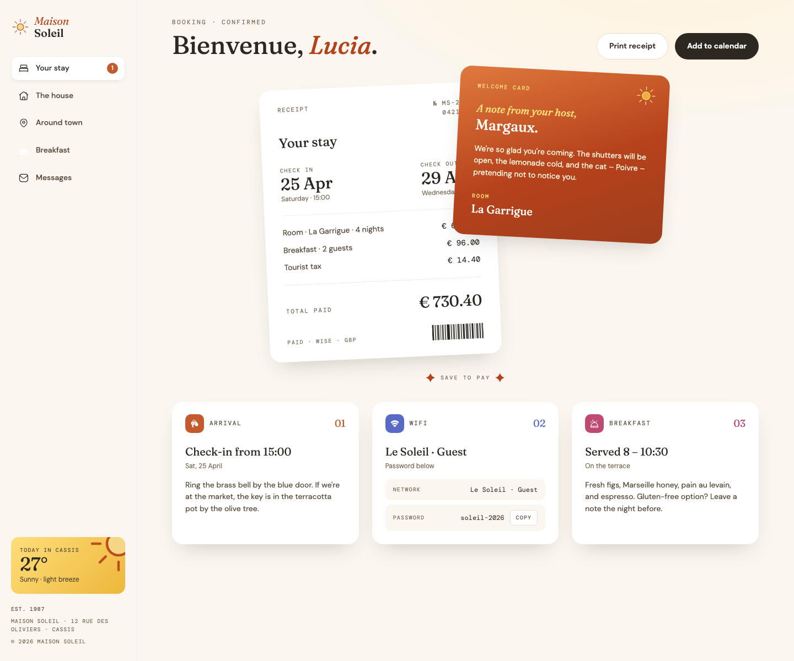

# Maison Soleil — hotel booking confirmation

A booking confirmation page for a fictional guest house: a persistent guest sidebar, a receipt for the stay, a note from the host, and three cards covering arrival, wifi, and breakfast.

## Table of contents

- [Overview](#overview)
  - [Screenshot](#screenshot)
  - [Links](#links)
- [Running the project](#running-the-project)
- [My process](#my-process)
  - [Built with](#built-with)
  - [Features](#features)
  - [What I learned](#what-i-learned)
  - [Continued development](#continued-development)
- [Author](#author)

## Overview

The layout is a two-part shell. On wide screens the sidebar is always present and the content sits beside it; below 900px the sidebar becomes an off-canvas menu opened from a hamburger button, with a scrim behind it.

### Screenshot



### Links

- Live Site URL: https://citron07r.github.io/FrontendMentor/hotel-booking-confirmation/

## Running the project

No build step or dependencies are required. Serve the repository root over HTTP and open the folder:

```bash
python3 -m http.server 8000
```

Then visit http://localhost:8000/hotel-booking-confirmation/.

## My process

### Built with

- Semantic HTML5 markup with `aside`, `main`, `nav`, `section`, and `article` landmarks
- CSS custom properties for the colour and shadow scale
- Flexbox for the shell and card rows
- A description list (`dl`/`dt`/`dd`) for the wifi network and password
- Vanilla JavaScript, no dependencies
- Fraunces, DM Sans, and DM Mono via Google Fonts

### Features

- **Copy the wifi password** — the button writes to the clipboard, swaps its label to "Copied", and reverts after two seconds. Where the Clipboard API is unavailable or refused, it falls back to a hidden textarea and `document.execCommand`, and reports "Copy failed" if that does not succeed either.
- **Off-canvas menu** — the hamburger opens the sidebar, moves focus to its close button, and shows a scrim. Escape, the close button, the scrim, and choosing a nav link all close it and return focus to the hamburger. While the panel is off-screen it is marked `inert` and `aria-hidden`, so its seven links and buttons leave the tab order instead of being reachable but invisible.

### What I learned

The `hidden` attribute is weaker than it looks. The scrim was written as `<div class="scrim" hidden>` with a `.scrim { display: block }` rule inside the mobile media query, and a class selector beats the browser's built-in `[hidden] { display: none }`. The result was a fixed, full-viewport, 45% opaque overlay sitting on top of the page at every mobile width, permanently — every tap landed on the scrim instead of the content underneath.

The fix is one rule that restores the attribute's meaning at the same specificity level:

```css
.scrim[hidden] {
  display: none;
}
```

The lesson generalises: any time a class sets `display` on an element that also relies on `hidden`, the attribute stops working, and the failure is easy to miss because the markup reads as if it is correct.

Moving an element off-screen with `transform` hides it from sight only. The sidebar's links stayed in the tab order at mobile widths, so a keyboard user pressing Tab from the hamburger walked through five nav links and a close button that were nowhere on screen. Toggling `inert` alongside the open state removes them from the tab order and the accessibility tree while the panel is away, and restores them when it slides in.

### Continued development

- Trap focus inside the sidebar while the off-canvas menu is open, so Tab cannot reach the page behind it
- Give the nav links, "Print receipt", and "Add to calendar" real behaviour

## Author

- GitHub - [@citron07r](https://github.com/citron07r)
- Frontend Mentor - [@citron07r](https://www.frontendmentor.io/profile/citron07r)
