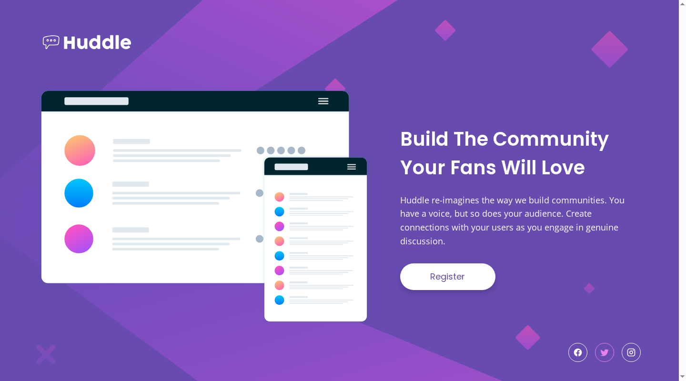
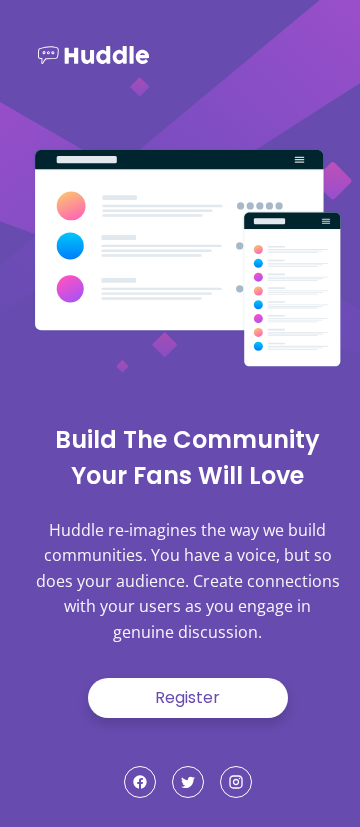

# Frontend Mentor - Huddle landing page with single introductory section

A solution to the [Huddle landing page with a single introductory section challenge on Frontend Mentor](https://www.frontendmentor.io/challenges/huddle-landing-page-with-a-single-introductory-section-B_2Wvxgi0).

## Table of contents

- [Overview](#overview)
  - [Screenshot](#screenshot)
  - [Links](#links)
- [Running the project](#running-the-project)
- [My process](#my-process)
  - [Built with](#built-with)
  - [What I learned](#what-i-learned)
  - [Continued development](#continued-development)
- [Author](#author)

## Overview

A one-screen marketing page: logo, hero illustration, headline, supporting copy, a register call to action, and social links. The layout stacks vertically on mobile and becomes a two-column split at 1024px, with a different decorative background image on each side of the 768px breakpoint.

### Screenshot

Desktop, 1440px:



Mobile, 375px:



### Challenge requirements

| Required behaviour | How it is met |
| --- | --- |
| Optimal layout for the device's screen size | Single column by default; two-column split at `min-width: 1024px`, with the header and footer padding widening at the same breakpoint |
| Background artwork adapts | `bg-mobile.svg` sized to `100vw` by default, swapped for `bg-desktop.svg` at `min-width: 768px` |
| Hover states for interactive elements | Register button inverts to the magenta accent; social icons shift border and glyph colour together via `currentColor` |
| Keyboard focus states | `:focus-visible` outlines on the register button and each social link, offset from the accent colour change |
| Keyboard bypass of the header | Visually hidden skip link, revealed on focus, jumps to `#main` |
| Icons and artwork exposed correctly | Social links carry `aria-label`; background artwork stays decorative in CSS so screen readers skip it |

### Links

- Live Site URL: https://citron07r.github.io/FrontendMentor/huddle-landing-page/

## Running the project

No build step or dependencies are required. Open `index.html` in a browser, or serve the repository root over HTTP:

```bash
python3 -m http.server 8000
```

Then visit http://localhost:8000/huddle-landing-page/.

## My process

The design contract for this page — colours, type scale, component states, and spacing — is written up in [DESIGN.md](./DESIGN.md) and the styles follow it.

### Built with

- Semantic HTML5 markup with `header`, `main`, and `footer` landmarks
- CSS custom properties
- Flexbox
- Mobile-first workflow with `min-width` breakpoints at 768px and 1024px
- Inline SVG for the social icons
- [Poppins](https://fonts.google.com/specimen/Poppins) and [Open Sans](https://fonts.google.com/specimen/Open+Sans) via Google Fonts

### What I learned

The background art changes between the two layouts rather than simply scaling, so it is set as a `background-image` on `body` and swapped at the 768px breakpoint. On mobile it is sized with `100vw auto` so the curve spans the viewport, and on desktop it reverts to `auto` so the SVG keeps its intrinsic proportions.

The social icons are inline SVG with `fill: currentColor`, so a single `color` change on the anchor drives both the border and the glyph on hover and focus. Each anchor carries an `aria-label` because the SVG itself has no accessible text.

Interactive elements share one accent colour for hover and focus, and `:focus-visible` adds an offset outline on top of that colour change, so keyboard users get a visible ring without mouse users seeing one on click.

A skip link sits before the header so keyboard users can jump past the logo straight to `#main`. It uses `:focus` rather than `:focus-visible`, because a skip link should appear for any focus that reaches it, and `main` carries `tabindex="-1"` so the jump actually moves focus in every browser.

Once focus lands there, `main:focus-visible` draws an accent outline so the reader can see where they arrived. Suppressing that outline would have made the skip link move focus invisibly; scoping the style to `:focus-visible` keeps the ring for keyboard users without showing it to anyone who clicks inside the section with a mouse.

The register button is sized with `min-width`, `min-height`, and padding instead of fixed `width`/`height`, so it holds the design's 200 × 40 (200 × 56 on desktop) at default settings but can still grow if the label or font size changes.

### Continued development

- Give the register link a real destination once there is somewhere for it to point

## Author

- GitHub - [@citron07r](https://github.com/citron07r)
- Frontend Mentor - [@citron07r](https://www.frontendmentor.io/profile/citron07r)
