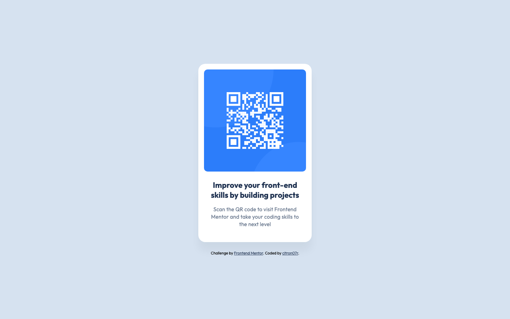

# Frontend Mentor - QR code component solution

This is a solution to the [QR code component challenge on Frontend Mentor](https://www.frontendmentor.io/challenges/qr-code-component-iux_sIO_H).

## Table of contents

- [Overview](#overview)
  - [Screenshot](#screenshot)
  - [Links](#links)
- [My process](#my-process)
  - [Built with](#built-with)
  - [What I learned](#what-i-learned)
  - [Continued development](#continued-development)
  - [Useful resources](#useful-resources)
  - [AI Collaboration](#ai-collaboration)
- [Author](#author)

## Overview

A single centred card holding a QR code, a heading, and a short paragraph. The card keeps a fixed maximum width and stays centred at every screen size, so the layout needs no breakpoint beyond a small padding adjustment on narrow phones.

### Screenshot



### Links

- Solution URL: https://www.frontendmentor.io/solutions/responsive-qr-card-centred-with-flexbox-and-css-custom-properties-qY3KRmyyRm
- Live Site URL: https://citron07r.github.io/FrontendMentor/qr-code-component/

## My process

### Built with

- Semantic HTML5 markup
- CSS custom properties
- Flexbox
- `rem` sizing so text follows the browser's font-size setting
- [Outfit](https://fonts.google.com/specimen/Outfit) via Google Fonts

### What I learned

The QR image rendered as a 2:1 rectangle even though the source file is square. The markup carries `width="576" height="576"` — good for reserving space and avoiding layout shift — but the CSS only set `width: 100%`. The width attribute was overridden while the height attribute was not, so the browser painted 288 × 576. Adding one line fixed it:

```css
.card img {
  width: 100%;
  height: auto;
}
```

The lesson is that `width`/`height` attributes and CSS width are not a matched pair; overriding one without `height: auto` breaks the aspect ratio.

A second bug came from positioning the footer:

```css
.attribution {
  position: absolute;
  bottom: 0.5rem;
}
```

Absolute positioning takes the footer out of flow, so on short viewports the vertically centred card grew underneath it and the credit line rendered on top of the card. Making the body a column flex container and letting the footer sit in normal flow removed the overlap without changing the desktop look.

Finally, repeating the whole `padding` shorthand inside the media query duplicated two values that never change. Moving only the value that varies into a custom property keeps a single source of truth:

```css
:root {
  --card-padding-bottom: 2.5rem;
}

.card {
  padding: 1rem 1rem var(--card-padding-bottom);
}

@media (max-width: 375px) {
  :root {
    --card-padding-bottom: 2rem;
  }
}
```

### Continued development

- Invert the breakpoint to a mobile-first `min-width` query in `em`, so it responds to zoom as well as viewport width
- Self-host the font instead of loading it from Google Fonts, removing the third-party request

### Useful resources

- [MDN: aspect ratio and the `width`/`height` attributes](https://developer.mozilla.org/en-US/docs/Web/HTML/Element/img#width) - explains why the attributes are worth keeping and why `height: auto` is needed alongside them.
- [MDN: `:focus-visible`](https://developer.mozilla.org/en-US/docs/Web/CSS/:focus-visible) - the reason the footer links show a ring for keyboard users but not on mouse click.

### AI Collaboration

I used Claude Code alongside this build, mainly for review and verification rather than writing the initial markup and styles.

- Driving a headless browser to measure the rendered layout. Checking `getBoundingClientRect()` is what exposed the stretched QR image and the footer overlapping the card — both looked plausible in a quick glance at the page.
- Working through the automated review feedback on the solution, fixing one finding at a time and re-measuring after each.
- Setting up GitHub Pages and keeping the commit history split into small, self-describing commits.

What worked well was using measurements rather than screenshots as the source of truth; a squished QR code is easy to miss by eye. What needed care was checking the right thing — the image's `naturalWidth` reported 576 × 576 and looked correct, because it reports the file's intrinsic size regardless of how the box is actually painted.

## Author

- GitHub - [@citron07r](https://github.com/citron07r)
- Frontend Mentor - [@citron07r](https://www.frontendmentor.io/profile/citron07r)
