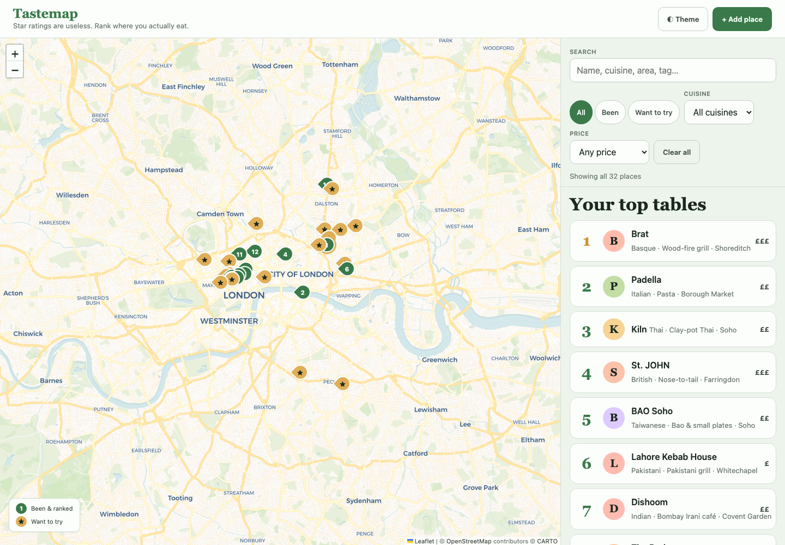

# Tastemap — a ranked map of where you actually eat

A personal restaurant map that replaces star ratings with a single honest order. You never score a place out of five; you compare it against places you have already been, and the ranking falls out of those answers.

## Table of contents

- [Overview](#overview)
  - [Screenshot](#screenshot)
  - [Links](#links)
- [Running the project](#running-the-project)
- [My process](#my-process)
  - [Built with](#built-with)
  - [Features](#features)
  - [What I learned](#what-i-learned)
  - [Continued development](#continued-development)
- [Author](#author)

## Overview

The app opens on a map of London with 32 seeded places — 14 ranked and 18 on the wishlist — beside a ranked list. Adding somewhere you have been starts a comparison flow instead of asking for a score, and the answers place it in the order.

### Screenshot



### Links

- Live Site URL: https://citron07r.github.io/FrontendMentor/restaurant-ranking-app/

## Running the project

The app fetches its seed data, so it needs to be served over HTTP rather than opened from the filesystem:

```bash
python3 -m http.server 8000
```

Then visit http://localhost:8000/restaurant-ranking-app/.

## My process

### Built with

- Semantic HTML5 with `header`, `main`, `aside`, and `dialog`-role overlays
- CSS custom properties, split into `tokens.css` (the design system) and `style.css` (the components that consume it)
- [Leaflet](https://leafletjs.com) for the map, with CARTO tiles
- Vanilla JavaScript, no framework or build step
- `localStorage` for persistence, seeded from `data/sample-places.json`

### Features

- **Ranking by comparison** — adding a place you have been to opens a duel: two places, pick the better one. The flow binary-searches the existing order, so placing a 15th restaurant takes about four questions rather than fourteen. Arrow keys choose, `T` records a tie, `Esc` bails out.
- **Map and list side by side** — 32 pins, cuisine-tinted avatars, ranked pins numbered and wishlist pins starred. Below the breakpoint the two become tabs.
- **Filters** — free-text search across name, cuisine, area, and tags, plus status, cuisine, and price filters, with a live result count announced politely.
- **Detail sheet** — per-place notes, address, and a website link only when one exists.
- **Light and dark themes**, remembered across visits.

### What I learned

The design system lives in its own file, and `style.css` makes 277 `var(--…)` references while defining none of them. That split is clean but it has a sharp edge: if `tokens.css` fails to arrive, every one of those references falls back to its initial value and the page renders as unstyled HTML — no layout, no colour, no map panel height. The single missing file was the only error in the console, and it took the whole interface down with it.

The lesson is about failure mode, not about tokens. A stylesheet that consumes variables it does not define has a hard dependency, and a hard dependency deserves either a fallback (`var(--color-surface, #fff)`) or an explicit check that it loaded.

The comparison flow was the other thing worth getting right. A naive implementation compares a new place against every ranked place, which is fine at 14 and miserable at 100. Treating the ranked list as sorted and binary-searching the insertion point turns that into a logarithmic number of questions — the "Question 1 of ~4" estimate the duel shows is `ceil(log2(n))`.

### Continued development

- Split `script.js` and `style.css`; both run long enough that map, ranking, and form concerns would be clearer as separate modules
- Recompute the order from the stored comparison history rather than persisting resolved positions, so an early answer can be revised
- Cluster the dense Soho pins, which overlap at low zoom

## Author

- GitHub - [@citron07r](https://github.com/citron07r)
- Frontend Mentor - [@citron07r](https://www.frontendmentor.io/profile/citron07r)
