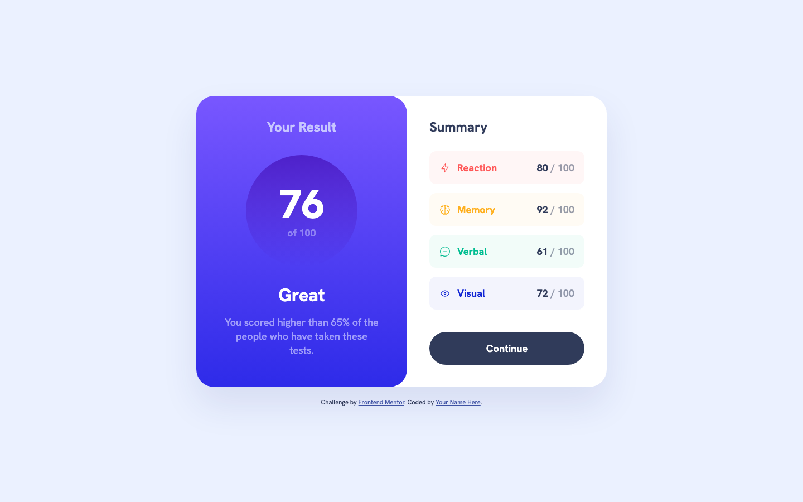

# Frontend Mentor — Results summary component

A solution to the [Results summary component challenge on Frontend Mentor](https://www.frontendmentor.io/challenges/results-summary-component-CE_K6s0maV).

## Table of contents

- [Overview](#overview)
- [Screenshot](#screenshot)
- [Links](#links)
- [Running the project](#running-the-project)
- [Built with](#built-with)
- [What I learned](#what-i-learned)
- [Continued development](#continued-development)
- [Author](#author)

## Overview

The challenge is to build a results summary card that matches the provided design and adapts between a stacked mobile layout and a two-column desktop layout.

Users should be able to:

- View the optimal layout depending on their device's screen size
- See hover and focus states for all interactive elements

## Screenshot



## Links

- Live site: https://citron07r.github.io/FrontendMentor/summary-component/
- Solution repository: https://github.com/citron07r/FrontendMentor/tree/main/summary-component

## Running the project

No build step or dependencies are required — the component is a single HTML file with inline styles and local font and icon assets.

Open `index.html` directly in a browser, or serve the folder over HTTP:

```bash
python3 -m http.server 8000
```

Then visit http://localhost:8000/summary-component/ from the repository root.

## Built with

- Semantic HTML5 markup
- CSS custom properties
- Flexbox
- Mobile-first workflow
- Self-hosted Hanken Grotesk via `@font-face`

## What I learned

Defining the colour palette as HSL custom properties on `:root` made the translucent category backgrounds trivial: the same hue is reused at 5% alpha with `hsla()` instead of hand-picking a second tint per category.

Decorative category icons are hidden from assistive technology with an empty `alt` attribute plus `aria-hidden`, while each panel is labelled through `aria-labelledby` pointing at its own heading, so the card reads as two named regions rather than a flat list of text.

The continue button uses `:focus-visible` with a double `box-shadow` ring so keyboard focus stays visible against both the white mobile background and the pale blue desktop background.

## Continued development

- Extract the inline `<style>` block into a separate stylesheet once more challenges share tokens
- Drive the scores from data rather than hard-coded markup

## Author

- GitHub: [@citron07r](https://github.com/citron07r)
- Frontend Mentor: [@citron07r](https://www.frontendmentor.io/profile/citron07r)
